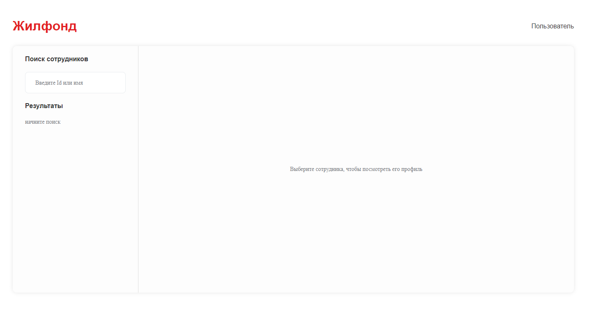
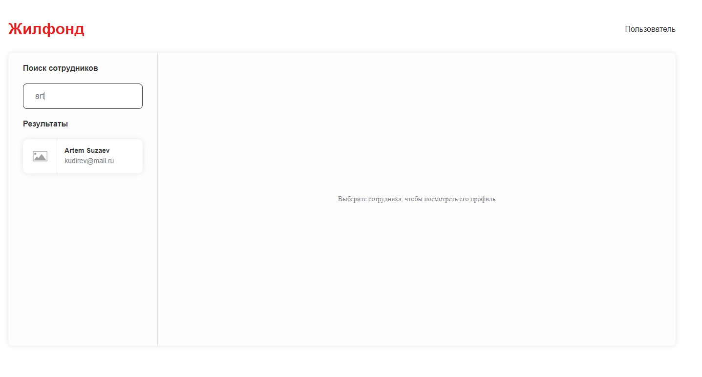
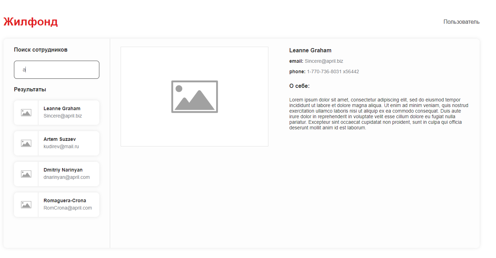

# ЖИЛФОНД

В данном проекте представлено решение тестового задания от компании ЖИЛФОНД.

## Задачи проекта
1. Необходимо реализовать страницу поиска сотрудников, с предпросмотром профиля.
2. Приложение состоит из двух страниц, в sidebar осуществляется поиск и отображение результатов, можно искать одного сотрудника или нескольких.
3. На главной отображается карточка пользователя с личными данными.

## Дополнительно
1. SPA должно быть реализовано с использованием Vue,Vuex.
2. Необходимо создать основные компоненты.
3. Использовать actions, mutations.
4. Стили должны быть написаны с помощью препроцессора Scss
5. Во время всех запросов нужно сигнализировать пользователю через прелоадер, что происходит запрос.
6. Использовать изоляцию стилей.

## Запуск проекта

### npm run dev

## Используемые технологии

- [HTML](https://developer.mozilla.org/ru/docs/Learn/Getting_started_with_the_web/HTML_basics) - язык разметки веб-страницы.
- [SCSS](https://sass-scss.ru/) - препроцессор CSS для описания внешнего вида HTML-документа
- [JS](https://developer.mozilla.org/ru/docs/Learn/JavaScript/First_steps/What_is_JavaScript) - язык программирования позволяющий создать динамичные веб-приложения.
- [Vue](https://vuejs.org/) - это JavaScript-фреймворк для создания пользовательских интерфейсов.
- [Vuex](https://vuex.vuejs.org/) - это библиотека управления состоянием.

## Вид интерфейса

